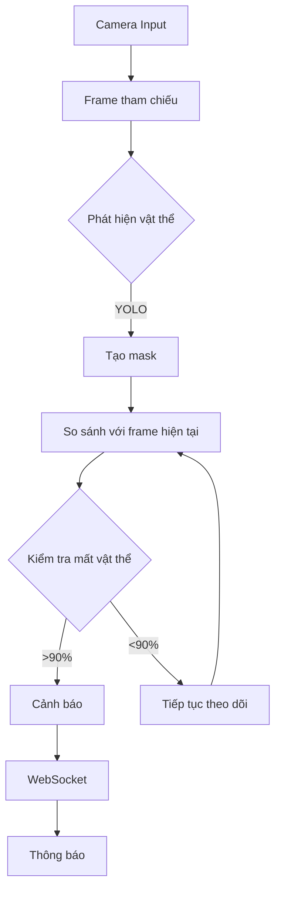
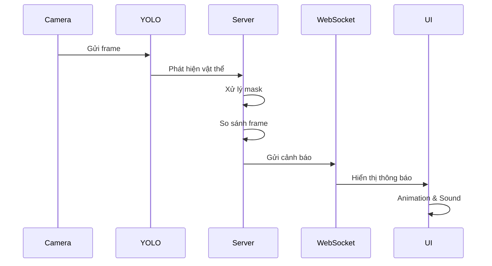

# Hệ Thống Phát Hiện Vật Thể Bị Đánh Cắp

<div align="center">

</div>

<p align="center">
  
  
  
  
</p>

## Sơ đồ hoạt động





## Chức năng chính

<details>
<summary>1. Phát hiện và theo dõi vật thể 🔍</summary>

- Phát hiện vật thể trong khung hình
- Tạo mask cho các vật thể được phát hiện  
- Theo dõi vị trí và trạng thái theo thời gian thực

</details>

<details>
<summary>2. Xác định frame tham chiếu 📸</summary>

- Cho phép người dùng chọn frame tham chiếu bằng phím 'q'
- Lưu trữ thông tin vị trí và mask của vật thể
- Làm cơ sở so sánh với các frame tiếp theo

</details>

<details>
<summary>3. Phát hiện vật thể bị mất 🚨</summary>

- So sánh frame hiện tại với frame tham chiếu
- Tính toán tỷ lệ diện tích bị mất
- Phát hiện khi vật thể bị mất >90% diện tích

</details>

<details>
<summary>4. Giao diện web thời gian thực 💻</summary>

- Hiển thị luồng video từ camera
- Hiển thị trạng thái hệ thống
- Danh sách cảnh báo gần đây
- Thông báo pop-up khi phát hiện mất

</details>

## Cài đặt và Sử dụng

<div class="animate__animated animate__fadeIn">

1. Clone repository:

```bash
git clone https://github.com/yourusername/object-detection.git
```

2. Cài đặt dependencies:

```bash
pip install -r requirements.txt
```

3. Chạy ứng dụng:

```bash
python app.py
```

4. Truy cập: http://localhost:5000

</div>

## Công nghệ sử dụng

<div class="tech-stack animate__animated animate__fadeInUp">

- 🔹 YOLO (You Only Look Once)
- 🔸 OpenCV 
- 🔹 Flask & Flask-SocketIO
- 🔸 WebSocket
- 🔹 HTML/CSS/JavaScript

</div>


